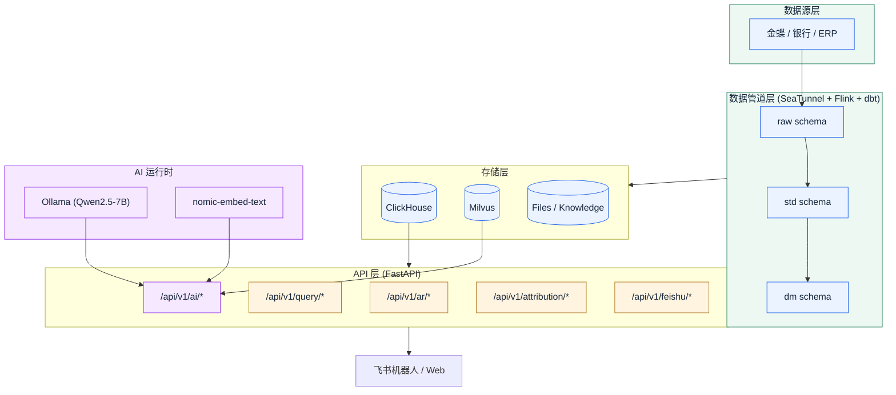

<div align="center">

# 💰 FinBoss


**企业财务 AI 信息化系统 · Finance Intelligence Workbench**

`[数据接入 → 质量规则 → 财务建模 → AI 自然语言查询 → 飞书机器人]`


[快速开始](#-快速开始) · [项目结构](#-项目结构) · [API 文档](#-api-文档) · [里程碑](#-phase-里程碑) · [架构](#-架构) · [致谢](#-致谢)

</div>

---

## 🎯 FinBoss 解决什么问题

财务团队的月度经营分析常常面对三类问题：金蝶/银行等数据源拉数困难、业务-财务对账口径不一致、临时分析需求响应慢。FinBoss 把这些统一到一个 AI 工作台：

- **数据接入层**：标准化金蝶、银行等 ERP/数据源接入到 ClickHouse 数据仓库
- **数据建模层**：raw/std/dm 三层 Pydantic schema + SeaTunnel/Flink/dbt 数据管道
- **业务服务层**：AR 应收汇总、客户级指标、归因分析、飞书机器人交互
- **AI 能力层**：Ollama 本地 LLM（Qwen2.5-7B）+ Milvus 向量库 + RAG 知识库 + 自然语言→SQL 查询

**Phase 1-4 已完成**：核心数据层 + AI 能力验证 + 企业集成 + 代码质量与安全加固。Phase 5-9 在规划中（生产硬化、SSO/RBAC、归因案例库、Phase 9 评审修复等）。

> **重要**：项目使用自有数据源（演示数据通过金蝶等真实接口模拟），**License 为 Proprietary**——使用与分发授权请向项目维护者（FinBoss Team）确认。

---

## ✨ 核心卖点

- **本地化 AI 推理** — Ollama + Qwen2.5-7B 全本地运行，财务数据不出企业内网
- **自然语言查询** — `/api/v1/ai/query` 把"本月应收总额是多少"自动翻译为 SQL 并返回结果
- **RAG 知识库** — 17 条财务领域知识（持续增长），版本化管理（CRUD + 版本历史 + 回滚）
- **三层数据契约** — raw/std/dm 严格分层，Pydantic schema 强校验
- **飞书机器人集成** — 财务团队在飞书群里直接对话式查询 AR / 归因 / 数据质量
- **归因分析服务** — 客户 × 时间维度交叉归因，自动定位收入波动来源
- **SQL 安全门禁** — Milvus 表达式注入 + ClickHouse LIMIT 注入 + Attribution SQL 模板注入已全部修复（Phase 4）

---

## 🏛️ 架构



---

## 🚀 快速开始

### 前置要求

- Docker 20.10+
- Docker Compose 2.0+
- Python 3.11+
- [`uv`](https://docs.astral.sh/uv/) 包管理器

### 五路启动方式

#### 方式 1 · Docker Compose 一键启动（推荐开发环境）

```bash
git clone https://github.com/davyzhong/finBoss.git
cd finBoss
cp .env.example .env
# 编辑 .env 填入金蝶数据库连接信息（OLLAMA_*, MILVUS_* 已有默认值）
docker-compose -f config/docker-compose.yml up -d
docker ps | grep finboss
```

#### 方式 2 · 本机启动 API（推荐生产开发）

```bash
# 启动基础设施（Docker 容器）
docker-compose -f config/docker-compose.yml up -d

# 安装依赖
uv sync

# 数据库迁移（如需要）
uv run alembic upgrade head

# 启动 API
uv run uvicorn api.main:app --reload --port 8000
```

#### 方式 3 · 拉取 AI 模型（首次运行）

```bash
docker exec finboss-ollama ollama pull qwen2.5:7b
docker exec finboss-ollama ollama pull nomic-embed-text
```

#### 方式 4 · 初始化财务知识库

```bash
uv run python scripts/ingest_financial_knowledge.py
```

#### 方式 5 · Docker 全栈镜像（生产环境预演）

```bash
# 占位：完整镜像构建在 Phase 8 规划中
# 当前推荐 Docker Compose + 本机 API 组合
```

### 60 秒 Quickstart

```bash
# 1. 启动基础设施
docker-compose -f config/docker-compose.yml up -d

# 2. 拉取 AI 模型（首次）
docker exec finboss-ollama ollama pull qwen2.5:7b
docker exec finboss-ollama ollama pull nomic-embed-text

# 3. 复制环境变量
cp .env.example .env

# 4. 初始化知识库
uv run python scripts/ingest_financial_knowledge.py

# 5. 启动 API
uv sync && uv run uvicorn api.main:app --reload --port 8000

# 6. 打开 Swagger UI
open http://localhost:8000/docs
```

### 真实输出

启动后访问：

- Swagger UI：http://localhost:8000/docs
- ReDoc：http://localhost:8000/redoc
- API 健康检查：`curl http://localhost:8000/api/v1/health`

---

## 📁 项目结构

```
finBoss/
├── config/          # 基础设施配置 (Docker, SeaTunnel, Flink, dbt)
├── connectors/      # 数据源连接器 (金蝶, 银行等)
├── schemas/         # Pydantic 数据模型 (raw/std/dm 三层)
├── pipelines/       # 数据管道 (接入/处理/数据集市)
├── services/        # 业务服务层
│   ├── ai/          # AI 服务 (Ollama, RAG, NLQuery)
│   └── feishu/      # 飞书机器人服务
├── api/             # FastAPI REST 接口
│   └── routes/      # API 路由 (ar/, query/, ai/, feishu/)
├── tests/           # 测试 (unit/, integration/)
├── finboss_mcp/     # MCP server（Agent 集成面）
└── scripts/         # 运维脚本
```

### MCP 集成（v2 新增）

`finboss-mcp` 命令暴露 FinBoss 的核心能力为 [Model Context Protocol](https://modelcontextprotocol.io/) 工具，方便 Claude / GPT / 自定义 Agent 直接调用：

```bash
uv run finboss-mcp
```

详见 [`finboss_mcp/`](finboss_mcp/) 目录与 Phase 5+ 实施文档。

---

## 📦 功能分组

### 🎯 数据接入与建模

- 🔌 **金蝶 / 银行 ERP 连接器** — [`connectors/`](connectors/) 内置领域适配
- 🏗️ **三层数据契约** — raw/std/dm 严格分层，schema 与血缘可追溯
- 📊 **数据质量规则** — 发布前阻断式检查，警告需填写确认原因
- 🔄 **SeaTunnel + Flink + dbt 管道** — 接入 / 处理 / 数据集市的工业级编排

### 🧠 AI 能力

- 🤖 **本地 LLM 推理** — Ollama + Qwen2.5-7B，财务数据不出内网
- 📚 **RAG 知识库** — Milvus 向量库 + 17 条财务知识（持续增长）
- 💬 **自然语言查询** — `/api/v1/ai/query` 自动 NL→SQL→结果→NL 解释
- ✍️ **提示词优化** — Few-shot Examples + 版本化管理
- 🔁 **知识版本管理** — CRUD + 版本历史 + 回滚（[`docs/superpowers/specs/`](docs/superpowers/specs/)）

### 📈 业务服务

- 💵 **AR 应收分析** — 公司级汇总、客户级指标、明细查询、质量检查
- 🔍 **归因分析** — 客户 × 时间维度交叉归因，自动定位收入波动来源
- 📋 **数据查询** — 只读 SQL 执行（白名单表名前缀 raw./std./dm.）
- 💬 **飞书机器人** — 卡片消息 + 自然语言交互

### 🔒 安全加固（Phase 4）

- ✅ Milvus 表达式注入已修复（`_escape_milvus_str()`）
- ✅ ClickHouse LIMIT 注入已修复（范围校验 + 表名白名单）
- ✅ Attribution SQL 模板注入已修复（参数化查询）
- ✅ 连接池优化（`@lru_cache` 替换服务工厂）
- ✅ 消息去重（`OrderedDict` FIFO 驱逐）
- ✅ CORS 可配置（`APP_CORS_ORIGINS` 环境变量）

---

## 🆚 同行对照

| 维度 | FinBoss | 通用 RAG 框架 | 传统 BI 工具 |
|---|---|---|---|
| 部署模式 | 本地 LLM，数据不出内网 | 通常云端 API | 数据仓库集中 |
| 领域适配 | 金蝶/银行 ERP 专用连接器 | 通用文本 RAG | 通用 SQL 查询 |
| 财务知识 | 内置 17 条财务知识 + 版本化 | 用户自行构建 | 通常无 |
| 交互入口 | Web API + 飞书机器人 | 通常 Web | Web Dashboard |
| 归因分析 | 客户 × 时间维度交叉 | 无 | 通常需手工建模 |
| SQL 安全 | 表名白名单 + sqlglot AST 白名单 | 不适用 | 通常仅 RBAC |

> FinBoss 定位是企业内部财务团队的 AI 工作台，不是通用 RAG 框架——重点是财务领域深度集成 + 数据不出内网。

---

## 📊 API 文档

启动服务后访问：

- Swagger UI：http://localhost:8000/docs
- ReDoc：http://localhost:8000/redoc

### AR 接口

| 端点 | 方法 | 描述 |
|------|------|------|
| `/api/v1/ar/summary` | GET | 公司级 AR 汇总 |
| `/api/v1/ar/customer` | GET | 客户级 AR 指标 |
| `/api/v1/ar/detail` | GET | AR 明细查询 |
| `/api/v1/ar/quality-check` | POST | 数据质量检查 |

### 数据查询接口

| 端点 | 方法 | 描述 |
|------|------|------|
| `/api/v1/query/execute` | POST | 执行只读 SQL（白名单表名） |
| `/api/v1/query/tables` | GET | 列出可用表 |

### AI 接口

| 端点 | 方法 | 描述 |
|------|------|------|
| `/api/v1/ai/query` | POST | 自然语言查询（NL → SQL → 结果 → NL 解释） |
| `/api/v1/ai/health` | GET | AI 服务健康检查 |
| `/api/v1/ai/rag/ingest` | POST | 添加知识文档 |
| `/api/v1/ai/rag/ingest/batch` | POST | 批量添加文档 |
| `/api/v1/ai/rag/search` | GET | 知识库检索 |
| `/api/v1/ai/knowledge` | GET/POST | 知识库管理（版本化） |
| `/api/v1/ai/knowledge/{id}` | GET/PUT/DELETE | 知识文档操作 |
| `/api/v1/ai/knowledge/{id}/history` | GET | 版本历史 |
| `/api/v1/ai/knowledge/{id}/rollback` | POST | 回滚到指定版本 |
| `/api/v1/attribution/analyze` | POST | 归因分析 |
| `/api/v1/feishu/events` | POST | 飞书 Webhook |

### AI 查询示例

```bash
# 自然语言查询
curl -X POST "http://localhost:8000/api/v1/ai/query?question=本月应收总额是多少"

# 知识库检索
curl "http://localhost:8000/api/v1/ai/rag/search?query=逾期率如何计算&top_k=3"

# AI 健康检查
curl "http://localhost:8000/api/v1/ai/health"
```

---

## 📋 Phase 里程碑

### Phase 1 ✅ 核心数据层（已完成）

- [x] Docker Compose 一键启动所有组件
- [x] ClickHouse 数据服务
- [x] FastAPI 提供 AR 查询接口
- [x] 数据质量规则

### Phase 2 ✅ AI 能力验证（已完成）

- [x] Ollama 本地 LLM 服务（Qwen2.5-7B）
- [x] Milvus 向量数据库
- [x] RAG 知识库（17 条财务知识）
- [x] NL 查询 POC（自然语言 → SQL → 结果 → NL 解释）
- [x] API 端点：`/api/v1/ai/*`

### Phase 3 ✅ 企业集成与增强（已完成）

- [x] 飞书机器人接入（消息 + 卡片交互）
- [x] 归因分析服务（客户 × 时间维度）
- [x] 提示词优化（含 Few-shot Examples）
- [x] 知识版本管理（CRUD + 版本历史 + 回滚）

### Phase 4 ✅ 代码质量与安全加固（已完成）

**P0 安全修复（3 项）**

- [x] Milvus 表达式注入：`_escape_milvus_str()` 转义
- [x] ClickHouse LIMIT 注入：范围校验 + 表名白名单
- [x] Attribution SQL 模板注入：参数化查询

**P1 可靠性修复（5 项）**

- [x] 连接池：`@lru_cache` 替换服务工厂
- [x] 消息去重：`OrderedDict` FIFO 驱逐
- [x] Schema 一致性：`passed_count`/`failed_count`
- [x] SQL 查询表名白名单：`raw.`/`std.`/`dm.` 前缀
- [x] 共享聚合逻辑：抽取 `pipelines/marts/ar_aggregations.py`

**P2 增强改进（3 项）**

- [x] Ollama httpx 0.26+ 兼容：全 async 重构
- [x] CORS 可配置：`APP_CORS_ORIGINS`
- [x] SQL 验证增强：sqlglot AST 白名单

### Phase 5+ 🚧 在规划中

详见 [`docs/superpowers/plans/`](docs/superpowers/plans/) 当前路线图：

- Phase 5 · Phase 6 · Phase 7 · Phase 8（生产硬化 + SSO/RBAC）
- Phase 9（归因案例库 + NLQuery 过滤器，已修复评审问题）

---

## 🗓️ Roadmap（v2）

- [x] Phase 1-4：核心数据层 + AI 能力 + 企业集成 + 安全加固
- [ ] Phase 5-7：规划中（详见 docs/superpowers/plans/）
- [ ] Phase 8：生产硬化 + SSO/RBAC（[`docs/superpowers/plans/2026-03-23-finboss-phase8-sso-rbac.md`](docs/superpowers/plans/)）
- [ ] Phase 9：归因案例库 + NLQuery 过滤器（[`docs/superpowers/plans/2026-03-24-finboss-phase9-plan.md`](docs/superpowers/plans/)）— 评审问题已修复
- [ ] MCP server GA（v0.2）— 当前为内测
- [ ] 完整镜像构建（生产环境）
- [ ] 飞书卡片模板库（v0.3）

---

## 🧪 开发与测试

### 日常检查

```bash
uv run pytest tests/ -v --cov=services --cov=api
uv run pytest tests/unit/ -v       # 仅单元测试
uv run pytest tests/integration/ -v # 仅集成测试
uv run ruff check .                 # 代码风格
uv run mypy services api           # 类型检查
```

### 项目约定

- Python 3.11+，所有方法 async（httpx 0.26+ 兼容）
- 代码风格：ruff（line-length=100）+ mypy strict
- Schema 严格分层：raw → std → dm，禁止跨层访问
- SQL 安全：仅允许 `raw.*` / `std.*` / `dm.*` 前缀表名 + sqlglot AST 白名单

---

## 🔒 安全

发现安全漏洞请通过 GitHub Private Vulnerability Reporting 提交，或邮件至项目维护者。

- 漏洞披露流程：[GitHub Security Advisories](https://github.com/davyzhong/finBoss/security/advisories/new)
- SECURITY.md：[`SECURITY.md`](SECURITY.md)（如不存在请向维护者索取）

## 🤝 贡献

欢迎 PR！请先阅读 [`docs/`](docs/) 中的相关设计文档与 Phase 计划，确保改动与项目阶段对齐。

- 代码风格：ruff + mypy strict
- 测试要求：所有 PR 必须通过 `tests/unit/` + `tests/integration/`
- 提交规范：参考 git 历史（`feat:` / `fix:` / `docs:` / `refactor:`）

## 📜 Code of Conduct

本项目采用 [Contributor Covenant](https://www.contributor-covenant.org/version/2/1/code_of_conduct/) v2.1 — 详见 [`CODE_OF_CONDUCT.md`](CODE_OF_CONDUCT.md)（如不存在请向维护者索取）。

---

## 📚 文档导航

- [系统设计](docs/superpowers/specs/2026-03-19-finboss-design.md)
- [实施计划](docs/superpowers/specs/2026-03-19-finboss-implementation-plan.md)
- [Phase 1 测试报告](docs/TEST_REPORT.md)
- [Phase 2 测试报告](docs/TEST_REPORT_PHASE2.md)
- [Phase 2 实施计划](docs/superpowers/plans/2026-03-20-finboss-phase2-plan.md)
- [Phase 8 SSO/RBAC 计划](docs/superpowers/plans/)
- [Phase 9 计划](docs/superpowers/plans/)

## 🤖 Built by

**FinBoss Team** — 兼管产品与研发的企业 AI 团队。

工程实践：

- 🤖 Claude / GPT 协作开发（[`CLAUDE.md`](CLAUDE.md) 含 Agent 工作流）
- 🐍 Python 3.11+ + FastAPI + Pydantic + SQLAlchemy + ClickHouse + Milvus + Ollama
- 📊 数据建模：raw/std/dm 三层 + dbt + SeaTunnel + Flink
- 🔒 安全加固：SQL 注入修复 + 连接池优化 + CORS 可配置

## 💖 致谢

- [FastAPI](https://fastapi.tiangolo.com/) — 高性能 Python Web 框架
- [ClickHouse](https://clickhouse.com/) — 列式数据库，OLAP 场景首选
- [Milvus](https://milvus.io/) — 开源向量数据库
- [Ollama](https://ollama.com/) — 本地 LLM 推理引擎
- [Qwen2.5](https://qwenlm.github.io/) — 阿里通义千问开源大模型
- [nomic-embed-text](https://huggingface.co/nomic-ai/nomic-embed-text-v1.5) — 嵌入式 RAG Embedding
- [飞书开放平台](https://open.feishu.cn/) — 企业 IM 与机器人集成
- [Model Context Protocol](https://modelcontextprotocol.io/) — Agent 工具协议

---

## 📜 License

**Proprietary** — 使用与分发授权请向 FinBoss Team 确认。

详见 [`pyproject.toml`](pyproject.toml) `license = "Proprietary"`。

---

<div align="center">

<sub>🤖 [FinBoss Team](https://github.com/davyzhong) 用 ❤️ 维护 · [⭐ Star 我们](https://github.com/davyzhong/finBoss) · [🐛 报告 Bug](https://github.com/davyzhong/finBoss/issues)</sub>
<br>
<sub>📜 本 README 按 readme-craft v3.0.0-alpha.0（16 铁律 + 10 反模式 + 80 分量表）适配。</sub>
<br>
<sub>📸 Screenshots auto-generated by GitHub Actions（<a href=".github/workflows/screenshot.yml">view workflow</a>）— readme-craft v3.0.0-alpha.0 T18</sub>

</div>
